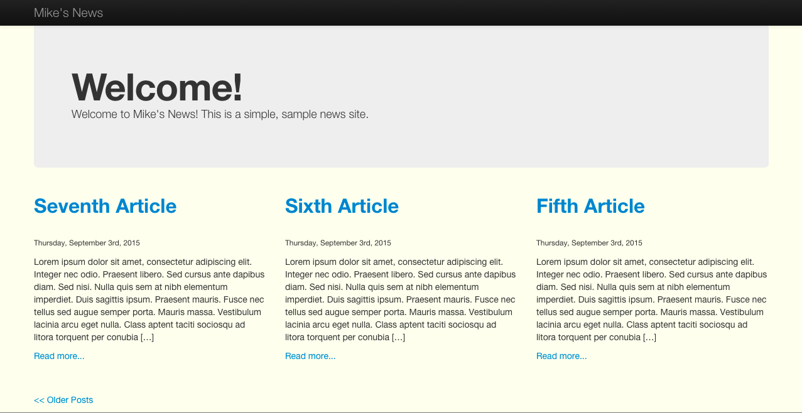
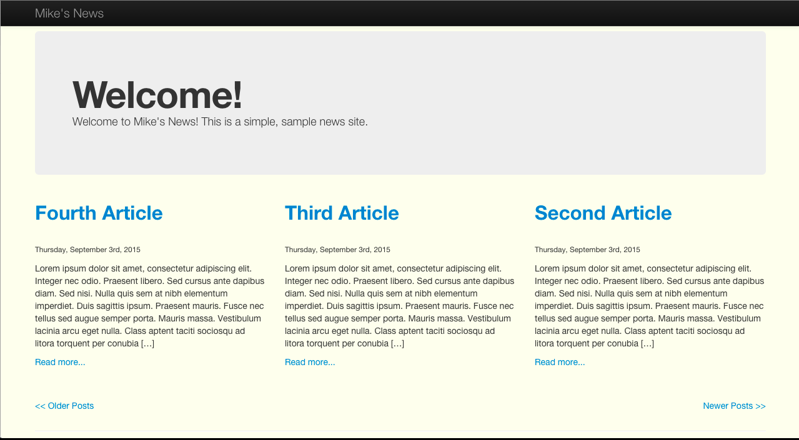
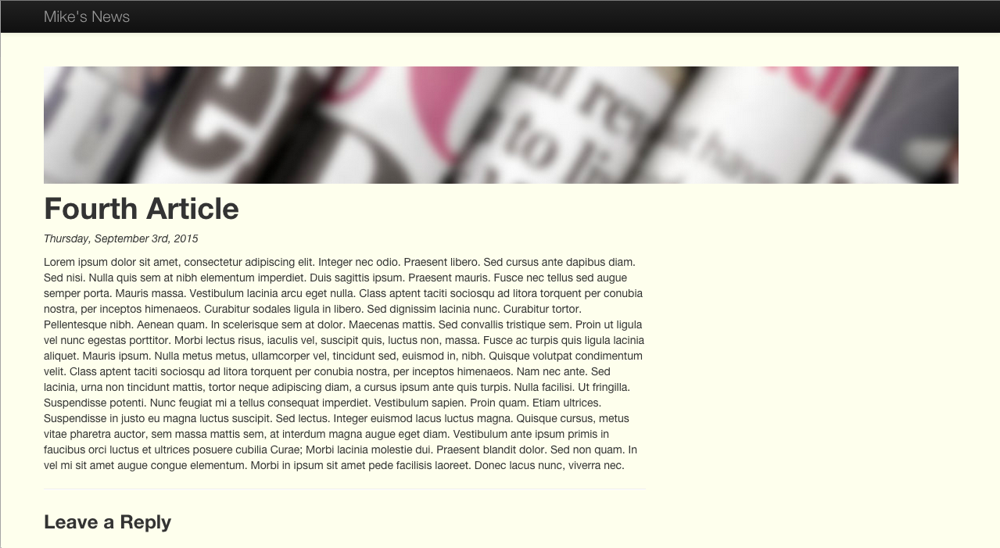

# mikesnews
Mike's News - A sample news site built using wordpress

Files that I've changed:

I built out the theme called 'mikesnews', which uses Bootstrap to help with the CSS. In my theme, I created the index.php, front-page.php, single.php, header.php, footer.php, functions.php, and style.css files.

Since I can't upload the database records that my local WP install is using, I'll provide some screenshots to show what the pages look like with 7 posts populated:

Front Page:
This is a dynamic page, which loads the latest 3 news articles and shows summaries. If there are older posts, a link is presented at the bottom to view the next 3.

Also, if there are newer posts, the Newer link will be displayed at the bottom:

Finally, when an article is expanded, it will lead to the single post template for that article, which looks like this:

